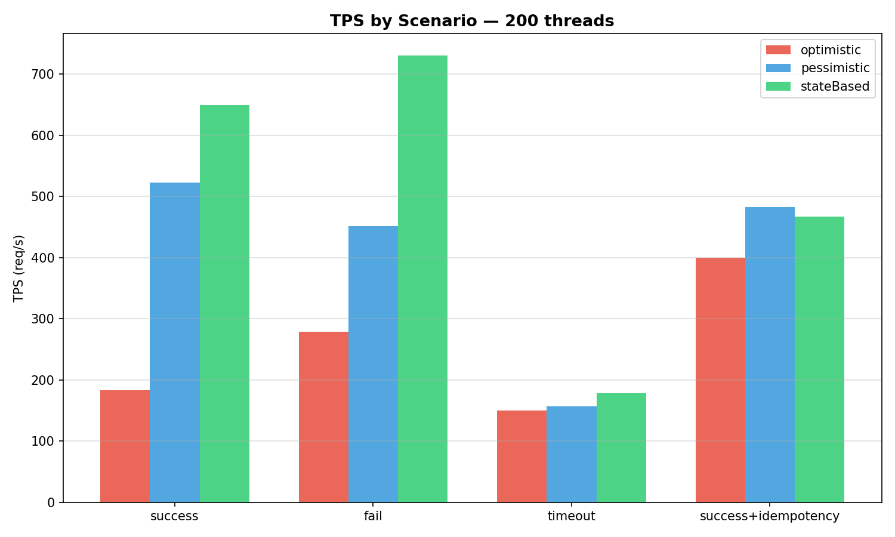
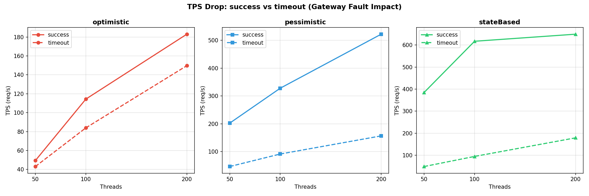

# reserveLab
***Concert Reservation System — 실험 기반 운영형 방어 시스템***

예약 시스템을 실험으로 검증하며 레이어별로 강화해나가는 프로젝트.
단순한 전략 비교가 아닌, 각 단계에서 문제를 발견하고 해결한 과정을 담았다.

상세 설계 과정 및 실험 분석은 블로그에서 확인할 수 있습니다.
- [동시성_제어_전략_비교_실험_세부내용](https://velog.io/@kang07/%EB%8F%99%EC%8B%9C%EC%84%B1-%EC%BB%A8%ED%8A%B8%EB%A1%A4-%EC%A0%84%EB%9E%B5-%EB%B9%84%EA%B5%90-%EC%8B%A4%ED%97%98)

---

## 방어 레이어 구조

```
레이어 1 (완성)  — DB 락 전략       : 정합성 보장
레이어 2 (진행중) — Redis dedup     : 중복 요청 차단
레이어 3 (예정)  — Circuit Breaker  : 외부 장애 격리
```

각 레이어는 이전 실험에서 발견한 한계를 해결하기 위해 추가되었다.

---

## 레이어 1 — DB 락 전략 비교 (완성)

### 문제 정의
동시성 환경에서 좌석 예약 시스템은 오버셀링 문제가 발생할 수 있다.
단순한 락 비교가 아니라,
- 충돌 강도에 따라 어떤 전략이 더 적합한가?

를 실험으로 검증하는 것이 목표이다.

### 실험 환경
- remainingSeats = 1000
- threadCount = 50 / 100 / 200
- maxRetry = 5
- 측정 지표: avg / P95 / P99 / TPS / 에러율 / retry / conflict / 상태 분포(SUCCESS·FAIL·TIMEOUT)

### 실험 시나리오
| 시나리오 | resultType | delayMs | 설명 |
|----------|------------|---------|------|
| success | SUCCESS | 100ms | 외부 호출 정상 응답 |
| fail | FAIL | 100ms | 외부 호출 실패 |
| timeout | TIMEOUT | 1500ms | read timeout 초과 |
| success+idempotency | SUCCESS | 100ms | 중복 요청 포함 (requestId 풀 절반 크기) |

### 전략 요약
**Optimistic Lock**
- @Version 기반, 충돌 허용 후 retry
- Low contention에 유리

**Pessimistic Lock**
- SELECT FOR UPDATE, 직렬화 기반 처리
- Tail latency 안정적

**State-Based 설계**
- PENDING → CONFIRMED / CANCELLED / EXPIRED
- 좌석 감소와 외부 결제 흐름 분리 (Tx1 → 외부 호출 → Tx2)
- 충돌 구간을 구조적으로 축소

### 실험 결과

#### 평균 Latency


#### P95 Latency


#### P99 Latency


#### 200 Threads 기준 P99 비교


### 핵심 발견
1. 평균 latency는 안정성을 설명하지 못한다.
2. High Contention 환경에서 Optimistic은 ***Tail Amplification*** 발생
3. P95/P99가 전략 선택의 핵심 지표
4. 설계 변경(State-Based)이 락 전략 변경보다 더 큰 효과를 보였다.
5. **그러나 중복 요청은 여전히 DB까지 도달한다** → 레이어 2 추가 배경

### 결론
동시성 전략은 "어떤 락이 더 좋은가"의 문제가 아니다.
- Low Contention → Optimistic
- High Contention → Pessimistic or State-Based
- 가능하다면 → 충돌 구간을 구조적으로 줄이는 설계가 최적

---

## 레이어 2 — Redis dedup (진행중)

### 문제 정의
success+idempotency 시나리오를 실험하면서 중복 요청이 서비스 레이어까지 도달한 뒤
IdempotencyStore에서 차단되는 구조임을 확인했다.

더 앞단에서 차단할 수 없을까?

현재 흐름:
```
중복 요청 → 서비스 레이어 도달 → IdempotencyStore에서 차단
```

Redis dedup 적용 후:
```
중복 요청 → Redis에서 차단 → 서비스 레이어에 도달하지 않음
```

### 실험 계획
- 트래픽 패턴: burst / steady / mixed
- 추가 지표: dedup hit ratio, DB 도달 요청 수, TPS 전후 비교

---

## 레이어 3 — Circuit Breaker (예정)

### 문제 정의
timeout 시나리오 실험에서 TPS가 급락하는 것을 확인했다.

| 전략 | success TPS (200t) | timeout TPS (200t) | 감소율 |
|---|---|---|---|
| pessimistic | 522.2 | 156.6 | **-70%** |
| stateBased | 649.4 | 178.7 | **-72%** |

원인: 게이트웨이 타임아웃(1500ms) 동안 쓰레드가 응답을 기다리며 점유된다.
이 시간 동안 새 요청은 처리되지 못하고 전체 TPS가 떨어진다.

Circuit Breaker로 장애를 빠르게 감지하고 이후 요청을 즉시 실패 반환하면 어떻게 달라지는가?

#### TPS by Scenario (200 threads)


#### success vs timeout TPS 직접 비교


### 실험 계획
- 재시도 방식 vs Circuit Breaker 비교
- 추가 지표: TPS, 에러율, 시스템 회복 시간 (OPEN → HALF-OPEN → CLOSED)

---

## 시스템 구조

```
ExperimentRunner (전략 × 시나리오 × 스레드 수 자동 루프)
   ↓
ReservationService
   ├─ Tx1: ReservationStrategy (Optimistic / Pessimistic / State-Based)
   ├─ 외부 호출: mock-gateway-server (SUCCESS / FAIL / TIMEOUT)
   └─ Tx2: ReservationTxService.applyResult (상태 전이 + 좌석 복구)
```

관측 계층:
```
ExecutionContext (ThreadLocal)
   ↓
MetricsCollector
   ↓
avg / P95 / P99 / TPS / 에러율 / 상태 분포
   ↓
CSV 출력
```
