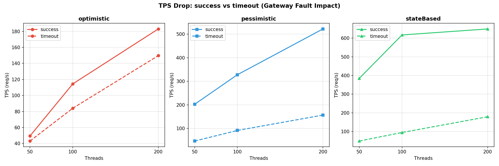

# reserveLab
***Concert Reservation System — 실험 기반 운영형 방어 시스템***

예약 시스템을 실험으로 검증하며 레이어별로 강화해나가는 프로젝트.
단순한 전략 비교가 아닌, 각 단계에서 문제를 발견하고 해결한 과정을 담았다.

상세 설계 과정 및 실험 분석은 블로그 시리즈에서 확인할 수 있습니다.

| 편 | 제목 |
|---|---|
| 1편 | [오버셀링이 왜 발생하는가](https://velog.io/@khseo/%EC%98%A4%EB%B2%84%EC%85%80%EB%A7%81%EC%9D%B4-%EC%99%9C-%EB%B0%9C%EC%83%9D%ED%95%98%EB%8A%94%EA%B0%80) |
| 2편 | [Optimistic vs Pessimistic - 실험으로 비교한 결과](https://velog.io/@khseo/Optimistic-vs-Pessimistic-%EC%8B%A4%ED%97%98%EC%9C%BC%EB%A1%9C-%EB%B9%84%EA%B5%90%ED%95%9C-%EA%B2%B0%EA%B3%BC) |
| 3편 | [State-Based 설계 - 락보다 설계가 효과적인 이유](https://velog.io/@khseo/State-Based-%EC%84%A4%EA%B3%84-%EB%9D%BD%EB%B3%B4%EB%8B%A4-%EC%84%A4%EA%B3%84%EA%B0%80-%ED%9A%A8%EA%B3%BC%EC%A0%81%EC%9D%B8-%EC%9D%B4%EC%9C%A0) |
| 4편 | [Redis dedup - 중복 요청이 DB까지 도달하지 않게 하는 법](https://velog.io/@khseo/%EC%A4%91%EB%B3%B5-%EC%9A%94%EC%B2%AD%EC%9D%B4-DB%EA%B9%8C%EC%A7%80-%EB%8F%84%EB%8B%AC%ED%95%98%EC%A7%80-%EC%95%8A%EA%B2%8C-Redis-dedup%EC%9C%BC%EB%A1%9C-%EB%A0%88%EC%9D%B4%EC%96%B4-%EB%B0%A9%EC%96%B4) |
| 5편 | [Circuit Breaker - 외부 장애를 시스템에서 격리하는 법](https://velog.io/@khseo/Circuit-Breaker-%EC%99%B8%EB%B6%80-%EC%9E%A5%EC%95%A0%EB%A5%BC-%EC%8B%9C%EC%8A%A4%ED%85%9C%EC%97%90%EC%84%9C-%EA%B2%A9%EB%A6%AC%ED%95%98%EB%8A%94-%EB%B2%95-uusfuq9l) |

---

## 방어 레이어 구조

```
레이어 1 (완성)  — DB 락 전략       : 정합성 보장
레이어 2 (완성)  — Redis dedup     : 중복 요청 차단
레이어 3 (완성)  — Circuit Breaker  : 외부 장애 격리
```

각 레이어는 이전 실험에서 발견한 한계를 해결하기 위해 추가되었다.

---

## 레이어 1 — DB 락 전략 비교 (완성)

### 문제 정의
동시성 환경에서 좌석 예약 시스템은 오버셀링 문제가 발생할 수 있다.
단순한 락 비교가 아니라,
- 충돌 강도에 따라 어떤 전략이 더 적합한가?

를 실험으로 검증하는 것이 목표이다.

### 실험 환경
- remainingSeats = 1000
- threadCount = 50 / 100 / 200
- maxRetry = 5
- 측정 지표: avg / P95 / P99 / TPS / 에러율 / retry / conflict / 상태 분포(SUCCESS·FAIL·TIMEOUT)

### 실험 시나리오
| 시나리오 | resultType | delayMs | 설명 |
|----------|------------|---------|------|
| success | SUCCESS | 100ms | 외부 호출 정상 응답 |
| fail | FAIL | 100ms | 외부 호출 실패 |
| timeout | TIMEOUT | 1500ms | read timeout 초과 |
| success+idempotency | SUCCESS | 100ms | 중복 요청 포함 (requestId 풀 절반 크기) |

### 전략 요약
**Optimistic Lock**
- @Version 기반, 충돌 허용 후 retry
- Low contention에 유리

**Pessimistic Lock**
- SELECT FOR UPDATE, 직렬화 기반 처리
- Tail latency 안정적

**State-Based 설계**
- PENDING → CONFIRMED / CANCELLED / EXPIRED
- 좌석 감소와 외부 결제 흐름 분리 (Tx1 → 외부 호출 → Tx2)
- 충돌 구간을 구조적으로 축소

### 실험 결과

#### 평균 Latency


#### P95 Latency


#### P99 Latency


#### 200 Threads 기준 P99 비교


### 핵심 발견
1. 평균 latency는 안정성을 설명하지 못한다.
2. High Contention 환경에서 Optimistic은 ***Tail Amplification*** 발생
3. P95/P99가 전략 선택의 핵심 지표
4. 설계 변경(State-Based)이 락 전략 변경보다 더 큰 효과를 보였다.
5. **그러나 중복 요청은 여전히 DB까지 도달한다** → 레이어 2 추가 배경

### 결론
동시성 전략은 "어떤 락이 더 좋은가"의 문제가 아니다.
- Low Contention → Optimistic
- High Contention → Pessimistic or State-Based
- 가능하다면 → 충돌 구간을 구조적으로 줄이는 설계가 최적

---

## 레이어 2 — Redis dedup (완성)

### 문제 정의
success+idempotency 시나리오에서 중복 요청이 서비스 레이어까지 도달한 뒤 차단되는 구조임을 확인했다.

더 앞단에서 차단할 수 없을까?

기존 흐름:
```
중복 요청 → 서비스 레이어 도달 → IdempotencyStore(ConcurrentHashMap)에서 차단
```

Redis dedup 적용 후:
```
중복 요청 → Redis SET NX EX → 차단 → 서비스 레이어에 도달하지 않음
```

### 구현
- `ReservationDedupService`: `StringRedisTemplate.setIfAbsent(key, value, ttl, SECONDS)` — 원자적 SET NX EX
- key: `requestId:concertId`, TTL: 30초
- 차단된 요청은 DB 트랜잭션 없이 즉시 반환

### 실험 시나리오
| 시나리오 | poolSize | threads | 중복 비율 |
|---|---|---|---|
| dedup_unique | 200 | 200 | 0% |
| dedup_mixed | 100 | 200 | 50% |
| dedup_high | 50 | 200 | 75% |
| dedup_burst | 1 | 200 | 99.5% |

### 실험 결과

#### DB 도달 vs Redis 차단


#### 중복 비율별 TPS


#### DB 부하 감소 효과


### 핵심 발견
1. dedup_burst: 200개 요청 중 199개가 Redis에서 차단, DB 도달 1개
2. 중복 비율이 높을수록 DB 부하가 선형으로 감소
3. Redis dedup은 DB 트랜잭션 없이 동작하므로 DB 부하 감소 효과가 즉각적
4. **그러나 외부 게이트웨이 장애 시 쓰레드 점유로 TPS가 급락한다** → 레이어 3 추가 배경

### 결론
Redis SET NX EX는 원자적으로 동작하므로 별도의 분산 락 없이 중복 요청을 차단할 수 있다.
차단 위치를 DB 레이어에서 애플리케이션 레이어 앞단으로 끌어올리는 것만으로 DB 부하가 구조적으로 감소한다.

---

## 레이어 3 — Circuit Breaker (완성)

### 문제 정의
timeout 시나리오 실험에서 TPS가 급락하는 것을 확인했다.

| 전략 | success TPS (200t) | timeout TPS (200t) | 감소율 |
|---|---|---|---|
| pessimistic | 522.2 | 156.6 | **-70%** |
| stateBased | 649.4 | 178.7 | **-72%** |

원인: 게이트웨이 타임아웃(1500ms) 동안 쓰레드가 응답을 기다리며 점유된다.
이 시간 동안 새 요청은 처리되지 못하고 전체 TPS가 떨어진다.

Circuit Breaker로 장애를 빠르게 감지하고 이후 요청을 즉시 실패 반환하면 어떻게 달라지는가?

#### success vs timeout TPS 직접 비교


### 구현
- Resilience4j `@CircuitBreaker(name = "mockGateway", fallbackMethod = "fallback")`
- `CallNotPermittedException` → CB 차단 지표 기록 후 즉시 반환
- sliding-window-size: 10 / failure-rate-threshold: 50% / slow-call-duration-threshold: 800ms / wait-duration-in-open-state: 5s

### 실험 시나리오
| 시나리오 | CB 상태 | resultType | delayMs | 설명 |
|---|---|---|---|---|
| cb_normal | CLOSED | SUCCESS | 100ms | 정상 동작 |
| cb_failure | CLOSED → OPEN | TIMEOUT | 1500ms | 게이트웨이 장애 발생 |
| cb_blocked | OPEN (강제) | SUCCESS | 100ms | CB 차단 효과만 측정 |

### 실험 결과

#### TPS 비교


#### CB 차단 분포 (cb_blocked)


#### 에러율 비교


#### TPS vs 에러율 종합


### 핵심 발견
1. 장애 중 TPS 90 → CB OPEN 후 TPS 1667, **약 18.5배 차이**
2. CB 차단 = fast fail: 응답 시간 1500ms → 수 ms, 쓰레드 점유 없음
3. slow call threshold가 핵심 — 실패뿐 아니라 느린 응답도 장애로 인식

### 결론
Circuit Breaker는 장애를 없애지 않는다. 장애가 전체 시스템으로 전파되는 것을 막는다.
에러율은 그대로지만, 시스템은 살아있다.

---

## 시스템 구조

```
ExperimentRunner (전략 × 시나리오 × 스레드 수 자동 루프)
   ↓
ReservationService
   ├─ ReservationDedupService (Redis SET NX EX — 중복 요청 차단)
   ├─ Tx1: ReservationStrategy (Optimistic / Pessimistic / State-Based)
   ├─ 외부 호출: mock-gateway-server (SUCCESS / FAIL / TIMEOUT)
   └─ Tx2: ReservationTxService.applyResult (상태 전이 + 좌석 복구)
```

관측 계층:
```
ExecutionContext (ThreadLocal)
   ↓
MetricsCollector
   ↓
avg / P95 / P99 / TPS / 에러율 / 상태 분포 / dedup 차단율
   ↓
CSV 출력
```
